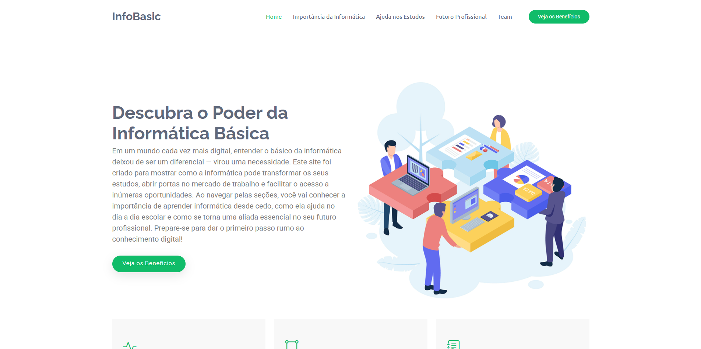
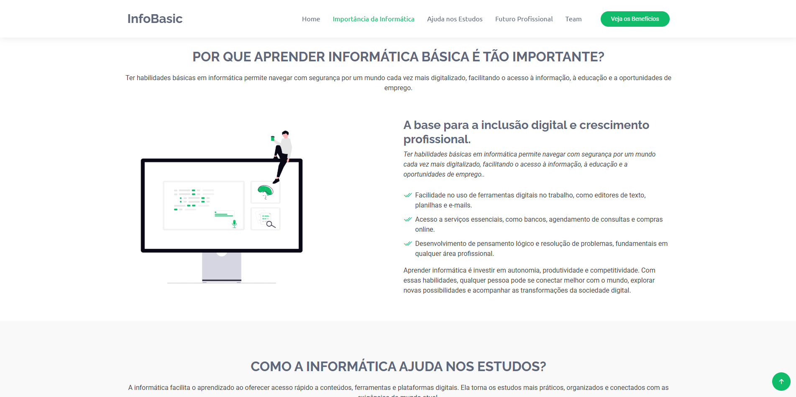
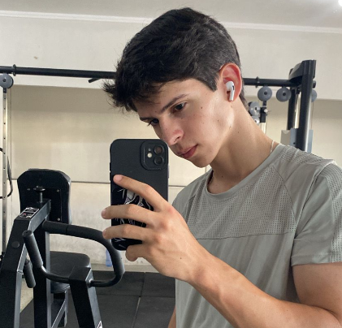
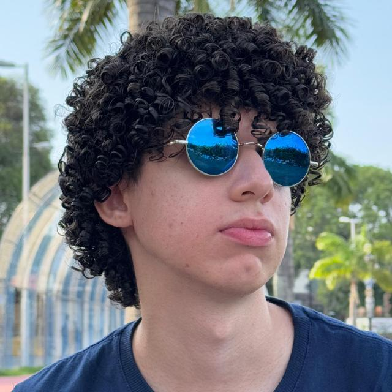
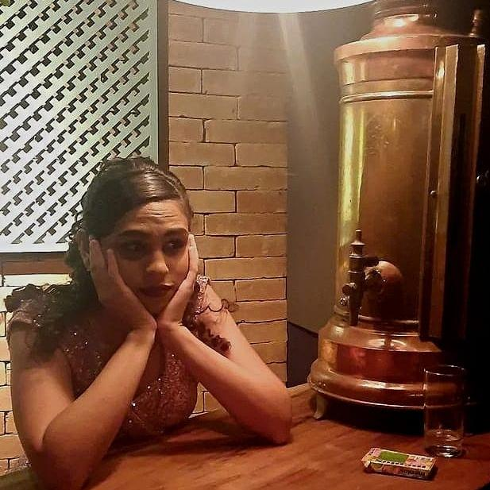

<h1 align="center" style="font-weight: bold;">InfoBasic 🖥️</h1>

<p align="center">
 <a href="#tech">Tecnologias/Technologies</a> • 
 <a href="#started">Começando/Getting Started</a> • 
  <a href="#colab">Colaboradores/Collaborators</a> •
 <a href="#contribute">Contribua/Contribute</a>
</p>

<p align="center">
    <b>Our project is a small website designed to interactively demonstrate the importance of learning how to use technology and how it can support us in the job market. Through an engaging and educational experience, we aim to highlight how digital skills can open doors to new professional opportunities.</b>
    <br><b>This project has 5 screens, which are:
    - Home
    - Importância da Informática
    - Ajuda nos Estudos
    - Futuro Profissional
    - Team</b>
</p>

<p align="center">
     <a href="https://github.com/imLaeL/infobasic">📱 Visite o Projeto/Visit this Project</a>
</p>

<h2 id="layout">🎨 Layout</h2>

<p align="center">
    
    
</p>

<h2 id="technologies">💻 Tecnologias/Technologies</h2>

- HTML
- CSS
- JAVASCRIPT
- BOOTSTRAP

<h2 id="started">🚀 Começando/Getting started</h2>

<h3>Clonando/Cloning</h3>

Como clonar nosso projeto/How to clone your project

```bash
git clone https://github.com/imLaeL/infobasic
```

<h2 id="colab">🤝 Colaboradores/Collaborators</h2>

Um agradecimento especial para aqueles que ajudaram no projeto/A special thanks to those who helped with the project.

<table>
  <tr>
    <td align="center">
      <a href="https://github.com/JoaoEstevam01">
        <br>
        <sub>
          <b>João Estevam</b>
        </sub>
      </a>
    </td>
    <td align="center">
      <a href="https://github.com/PedroRamalho141">
        <br>
        <sub>
          <b>Eduardo Honório</b>
        </sub>
      </a>
    </td>
    <td align="center">
      <a href="https://github.com/Yann-Thallys">
        <br>
        <sub>
          <b>Yann Thallys</b>
        </sub>
      </a>
    </td>
        <td align="center">
      <a href="https://github.com/imLaeL">
        <br>
        <sub>
          <b>Isaque Lael</b>
        </sub>
      </a>
    </td>
        <td align="center">
      <a href="https://github.com/devGabrielly">
        <br>
        <sub>
          <b>Maria Gabrielly</b>
        </sub>
      </a>
    </td>
  </tr>
</table>

<h2 id="contribute">📫 Contribua/Contribute</h2>

Caso tenha alguma ideia para melhoria, suporte ou adição entre em contato/If you have any ideas for improvement, support, or additions, please get in touch:

Email: joaoestevam.1204@gmail.com

